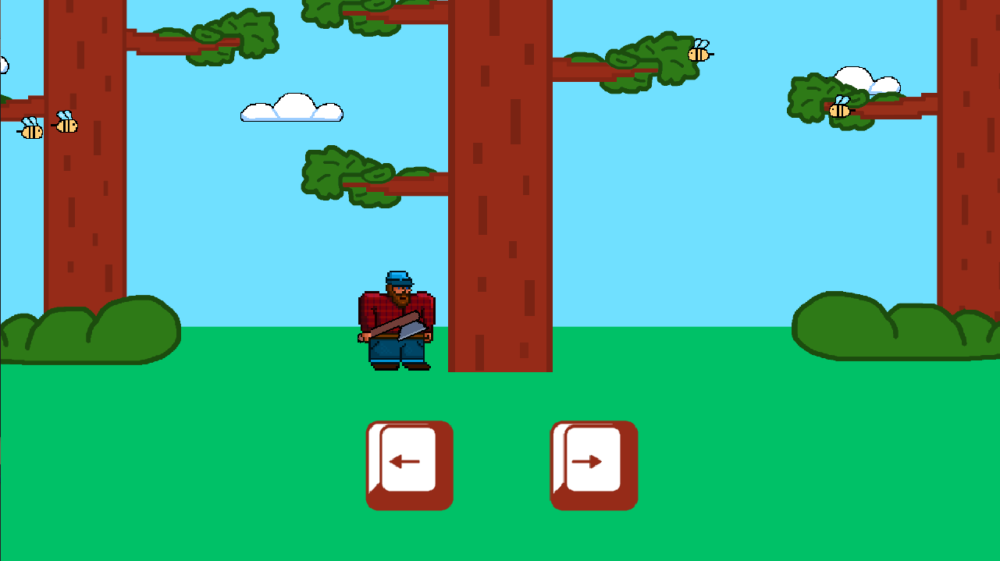
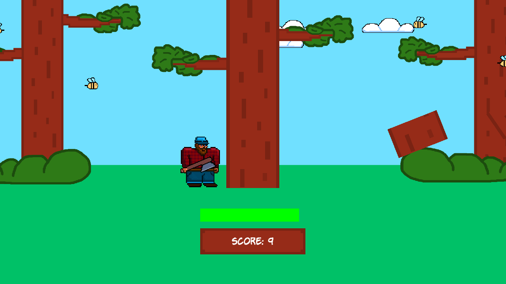
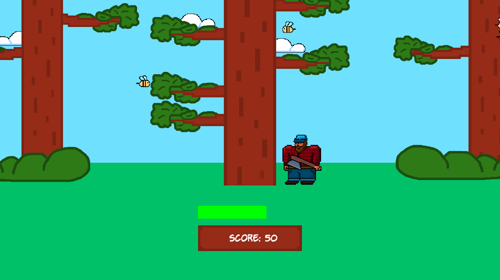

# Timberman-SFML
## IT
Progetto/Giochino creato durante i miei studi di informatica all'università di Padova.
Il gioco è un "Remake" di TimberMan creato in C++ con le librerie SFML e Tgui.

## EN
This Project/Game was created during my computer science studies at the University of Padua.
The game is a TimberMan "Remake" created in C++ with the SFML and Tgui libraries.

## Screenshots

